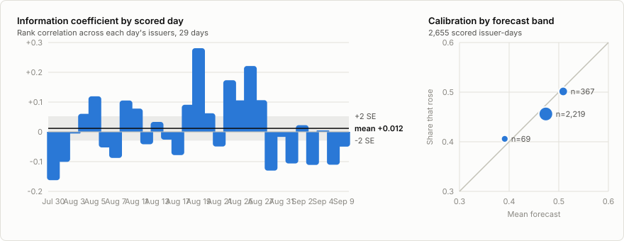

# Arbiter

[](https://github.com/aidankaras/arbiter/actions/workflows/ci.yml)
[](LICENSE)
[](pyproject.toml)

**Does an LLM agent beat a conventional model at forecasting equity moves from SEC
filings, when both see exactly the same information?** Arbiter is built to
measure that. It freezes each filing into an immutable, content-hashed evidence
packet stamped with the filing's acceptance time, so that every forecasting
approach can be scored on byte-identical inputs.

## Current result

The conventional arm, measured on insider transactions:



- **Mean information coefficient +0.121 (t = 3.09)** over 11 out-of-sample days
  and 592 issuer-days, scored strictly after the 17 days it was fitted on.
- **Calibration no better than a constant.** Brier skill is +0.003 against
  forecasting the fitting period's up-rate, inside the noise.
- One sample from one regime: a measurement of the control, not a strategy. Full
  report: [`reports/baseline-insider.md`](reports/baseline-insider.md).

An earlier result was withdrawn after duplicated rows were found in the event
store; [`reports/withdrawn/`](reports/withdrawn/) keeps it and the reason.

## What is built

| Component | Status |
|---|---|
| EDGAR ingestion (Form 4, 8-K) and event extraction | Built |
| Market data and five-session abnormal-return labels | Built |
| Resumable historical backfill | Built |
| Content-hashed evidence packets with point-in-time enforcement | Built |
| Baseline arm (logistic regression) and out-of-sample evaluation | Built |
| Append-only prediction ledger and spend metering | Built |
| Comparable retrieval | Not built |
| Neural, agent and arbiter arms | Not built |
| Shadow portfolios and dashboard | Not built |
| Earnings strategy (XBRL) | Not built |

The agent arm is next. Sections below describing unbuilt parts use the future
tense; anything in the present tense refers to code in this repository. Paper
trading only, always.

## Quickstart

```bash
git clone https://github.com/aidankaras/arbiter && cd arbiter
uv sync --all-extras
cp .env.example .env                        # SEC_USER_AGENT, plus Alpaca keys for prices
uv run arbiter ingest 2026-08-10            # one day of filings -> events
uv run arbiter resolve 2026-08-10 insider   # once the outcome window has closed
uv run arbiter backfill 2026-03-02 2026-08-14 --every 4
uv run arbiter report --domain insider      # fit, score, write reports/
```

[`docs/running-the-pipeline.md`](docs/running-the-pipeline.md) explains what each
command records and why.

## The four arms

Each event will be scored by four approaches that see byte-identical inputs. One is built:

| Arm | Approach | Sees text | Uses an LLM | Built |
|---|---|---|---|---|
| `baseline` | Logistic regression over structured filing features | No | No | Yes |
| `dl` | Fine-tuned transformer encoder with a tabular head | Yes | No | No |
| `agent` | Agent team with per-domain analysts | Yes | Yes | No |
| `arbiter` | A different model family reviewing the other three and their reasoning | Indirect | Yes | No |

`baseline` is the null hypothesis. Anything that cannot beat a logistic
regression on a handful of features has not demonstrated anything.

It is deliberately weak, and stays that way. An elaborate control would confound
the question being asked: if a gradient-boosted ensemble beat the agent, the
finding would be about model capacity rather than about reading a filing. Its
regularisation is left at the library default for the same reason — tuning it
against the evaluation data would report the best of several attempts as though
it were one measurement.

The `arbiter` arm is a fourth prediction, not a gate. It never vetoes the other
arms, because an arm whose live record has been filtered by another model is no
longer comparable to anything. All four will maintain shadow portfolios; only
the arbiter's book will be mirrored to the paper brokerage account.

## Why the evidence packet is the center of the design

A comparison between approaches is only meaningful if the approaches saw the same
thing. Arbiter enforces that structurally rather than by convention.

Each event produces exactly one **evidence packet**: an immutable, content-hashed
object stamped with the filing's EDGAR acceptance time. It contains the
extracted filing, issuer metadata, and market context truncated at that
timestamp; once retrieval is built it will also carry comparable historical
cases, restricted to those that had already resolved.

Downstream of the packet, nothing will fetch. The agent analyst, once built, is
constructed with an empty tool list, so it cannot look anything up. The
prediction ledger requires the hash of the packet each forecast was made from,
which will make any published result reproducible and any silent change to
packet construction detectable. The baseline arm predates the packets: it reads
the same filing fields from the event store and writes no ledger rows, and it
moves onto packets alongside the first language-model arm.

Restricting comparables by time closes the most common source of invalid
results in event-study work: retrieving a "similar past case" whose outcome had
not yet occurred at the time of the event being predicted. Comparable lookups
will carry the event's own timestamp and filter on it in the query itself.

## Strategies

Three event families are designed to share one platform, so that adding a
fourth requires no platform changes. Insider transactions and red flags are
ingested and labeled today; earnings is not yet built.

- **Earnings** (planned) — 8-K Item 2.02 plus XBRL company facts. Surprise is computed as a
  seasonal random walk against the same quarter last year, scaled by the
  volatility of trailing surprises, which avoids any dependency on paid analyst
  consensus data.
- **Insider transactions** — Form 4 ownership filings. Role, transaction code,
  size relative to existing holdings, and clustered buying. Almost entirely
  structured; little text.
- **Corporate red flags** — 8-K items covering auditor changes, non-reliance and
  restatement notices, and executive departures. Low volume, high text
  dependence.

The contrast between the second and third is the most informative comparison the
system can produce: if language models hold an advantage, it should appear where
the signal lives in prose and disappear where it lives in a table.

## Target and evaluation

The primary target is five-trading-day abnormal return against a sector ETF,
entered at the first open after the filing's acceptance timestamp. Every arm
emits a probability that the return is positive, so calibration is measurable
for every arm, not only the language models.

Reported today: the information coefficient by day, a reliability table, and
Brier skill. Planned with the other arms: directional accuracy, shadow portfolio
performance with modelled costs, cost per decision, and pairwise disagreement
with conditional accuracy.

**Backtest and forward results are reported separately and labeled everywhere.**
The LLM arms were trained on data covering the backtest period, so backtested
performance overstates their ability by an unknown amount. Because labels resolve
in five trading days, genuine out-of-sample evidence accumulates continuously, and
the gap between backtest and forward performance is itself a measured result.

## Architecture

The target design. Ingestion, event detection, packets, the baseline arm, label
resolution and evaluation exist today; the rest is planned.

```
ingestion (no LLM) → event detection (no LLM) → evidence packet (immutable, hashed)
                                                        │
                        ┌───────────────┬───────────────┼───────────────┐
                     baseline          dl             agent          arbiter
                        └───────────────┴───────────────┼───────────────┘
                                                        │
                        predictions written before any outcome exists
                                                        │
                    ┌───────────────────┬───────────────┴──────────────┐
              shadow portfolios    t+5 label resolution          evaluation
                    └───────────────────┴──────────────┬──────────────┘
                                                        │
                                        dashboard + weekly research report
```

Language models will be confined to extraction and judgment. Position sizing
and order placement will be deterministic code, so no model output can reach the
broker without passing through explicit risk limits.

## Stack

In use today: Python 3.12 with `uv`; date-partitioned Parquet for ingested
events and labels, and gzipped JSON Lines for packets; PostgreSQL with Alembic migrations for the
append-only prediction and usage ledger; scikit-learn for the baseline arm;
Docker Compose for local services; GitHub Actions for CI (Ruff, strict Pyright,
pytest, and a full-history secret scan).

Planned with the arms that need them: `pgvector` for comparable retrieval,
LangGraph for the agent arm, PyTorch with `transformers` and `peft` for the
neural arm, and FastAPI for the dashboard.

## Documentation

| Document | Contents |
|---|---|
| [`docs/architecture.md`](docs/architecture.md) | Component boundaries and data flow |
| [`docs/running-the-pipeline.md`](docs/running-the-pipeline.md) | What each command does and records |
| [`docs/methodology.md`](docs/methodology.md) | Leakage controls, labeling, evaluation design |
| [`docs/code-standards.md`](docs/code-standards.md) | Engineering standards for this repository |
| [`docs/data-provenance.md`](docs/data-provenance.md) | Sources, licensing terms, and what is redistributed |
| [`docs/operations.md`](docs/operations.md) | Telemetry, spend ceilings, and running migrations |
| [`docs/strategies/`](docs/strategies/) | Per-strategy event definitions and features |
| [`docs/lessons/`](docs/lessons/) | Concept notes covering the design decisions behind each subsystem |
| [`reports/`](reports/) | Measurements, each committed with the code that produced it |

## Disclaimer

Research software. Paper trading only. Nothing here is investment advice, and no
component of this system is designed or tested for use with real capital.

## License

MIT. See [LICENSE](LICENSE).
